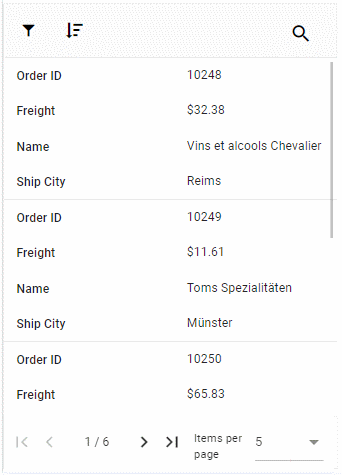

# Adaptive in ##Platform_Name## Grid Control

The Grid user interface (UI) was redesigned to provide an optimal viewing experience and improve usability on small screens. This interface will render the filter, sort, column chooser, column menu(supports only when the `rowRenderingMode` as Horizontal) and edit dialogs adaptively and have an option to render the grid row elements in the vertical direction.

## Render adaptive dialogs

The Syncfusion ##Platform_Name## Grid offers a valuable feature for rendering adaptive dialogs, specifically designed to enhance the user experience on smaller screens. This feature proves especially useful for optimizing the interface on devices with limited screen real estate. The functionality is achieved by enabling the [enableAdaptiveUI](../../api/grid/#enableadaptiveui) property, allowing the grid to render filter, sort, and edit dialogs in full-screen mode.

The following sample demonstrates how to enable and utilize adaptive dialogs in the Syncfusion ##Platform_Name## Grid:



 







        
















## Vertical row rendering

The Syncfusion ##Platform_Name## Grid introduces the feature of vertical row rendering, allowing you to display row elements in a vertical order. This is particularly useful for scenarios where a vertical presentation enhances data visibility. This is achieved by setting the [rowRenderingMode](../../api/grid#rowrenderingmode) property to the value **Vertical**.

>The default row rendering mode is **Horizontal**.

The following sample demonstrates how to dynamically change the row rendering mode between **Vertical** and **Horizontal** based on a DropDownList selection:



 







        
















> [enableAdaptiveUI](../../api/grid/#enableadaptiveui) property must be enabled for vertical row rendering.

### Supported features by vertical row rendering

The following features are only supported in vertical row rendering:

* Paging, including Page size dropdown
* Sorting
* Filtering
* Selection
* Dialog Editing
* Aggregate
* Infinite scroll
* Toolbar - Options like **Add**, **Filter**, **Sort**, **Edit**, **Delete**, **Search**, and **Toolbar template** are available when their respective features are enabled. The toolbar dynamically includes a three-dotted icon, containing additional features like **ColumnChooser**, **Print**, **PdfExport**, **ExcelExport**, or **CsvExport**, once these features are enabled. Please refer to the following snapshot.

A snapshot of the adaptive grid displaying enabled paging along with a pager dropdown.

> The Column Menu feature, which includes grouping, sorting, autofit, filter, and column chooser, is exclusively supported for the Grid in **Horizontal** [rowRenderingMode](../../api/grid#rowrenderingmode).
